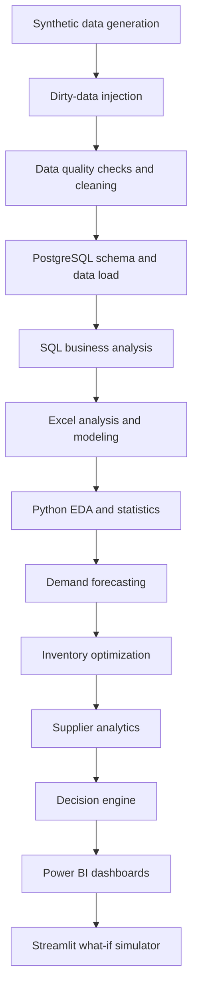

# OptiChain — Retail Demand, Inventory & Profit Optimization Platform

An end-to-end retail analytics and decision-support platform for demand, profitability, inventory, promotions, and supplier fulfillment.

## Project Overview

OptiChain brings retail sales, inventory, promotion, order, and supplier data into a decision workflow. It helps answer not only what is happening across stores and products, but also what action to take next: where to replenish, where to reduce future orders, and how operating assumptions affect revenue, profit, and inventory requirements.

The project combines SQL business analysis, Excel modeling, Python EDA and statistics, product-demand forecasting, inventory optimization, supplier analytics, a rule-based decision engine, Power BI dashboard pages, and a Streamlit what-if simulator. The outputs are intended as analytical decision support, not automated or guaranteed business outcomes.

## Business Problem

Retailers have to maintain enough stock to serve demand without tying up too much capital in excess inventory. Promotions can increase sales while reducing margin; supplier delays and short shipments can undermine service levels; and decisions made from revenue alone can hide weak profitability. OptiChain brings these trade-offs together so that replenishment and commercial decisions can be evaluated against demand, cost, supplier performance, and profit.

## Business Objectives

- Analyze demand, revenue, and profit by product, store, category, and time.
- Identify high-revenue/low-margin products and inventory risk patterns.
- Review promotion-period profit and ROI alongside sales behavior.
- Forecast daily product-level demand.
- Estimate safety stock, reorder points, and EOQ, then optimize order quantities under budget and capacity limits.
- Evaluate supplier delivery reliability, fill rate, lead-time variability, and defects.
- Convert inventory outputs into `ORDER`, `HOLD`, or `REDUCE FUTURE ORDERS` actions.
- Explore demand, discount, lead-time, and service-level scenarios in Streamlit.

## Analytical Questions

1. What drives product demand?
2. Which products and stores generate the most profit, not just revenue?
3. Which promotions appear profitable after accounting for marketing cost?
4. Which products are at risk of stockout, and where is inventory comparatively high?
5. How much inventory should be ordered, and when?
6. Which suppliers provide reliable fulfillment, and at what cost trade-off?
7. How do changes in demand, pricing, lead time, and service level affect modeled profitability and inventory requirements?

## End-to-End Architecture / Workflow



The generator writes dimension and fact CSVs, dirty-data injection creates a sales-quality exercise, and the quality notebook produces the cleaned sales file. PostgreSQL schema and loading scripts support the SQL analysis layer. The forecasting and inventory notebooks write processed outputs; the decision engine combines recommendation files with the latest inventory snapshot. Power BI screenshots and the Streamlit app expose analytical results and scenario inputs.

## Dataset & Data Model

The generated dataset covers **12 stores, 60 products, 8 suppliers, and 730 daily dates** from 2024-01-01 through 2025-12-30. It includes sales, inventory, promotions, orders, and supplier deliveries. The data is synthetic and generated using explicit business rules. The project requirements describe its patterns as calibrated against public retail datasets such as Rossmann and M5; it is not real transactional data.

The PostgreSQL schema is star-schema-style, with these dimensions and facts:

| Type | Tables |
|---|---|
| Dimensions | `dim_date`, `dim_product`, `dim_store`, `dim_supplier` |
| Facts | `fact_sales`, `fact_inventory`, `fact_promotions`, `fact_orders`, `fact_supplier_deliveries` |

The schema defines `v_supplier_performance` and `v_inventory_kpis` for reusable supplier and inventory measures.

## Data Generation & Data Quality

The generation and quality workflow is implemented in [`src/generate_data.py`](src/generate_data.py), [`src/inject_dirty_data.py`](src/inject_dirty_data.py), [`src/data_quality_check.py`](src/data_quality_check.py), and [`notebooks/01_data_quality.ipynb`](notebooks/01_data_quality.ipynb). Injection adds duplicate sales keys, non-positive prices, negative quantities, and missing discount values. Cleaning deduplicates on date/store/product/transaction, removes non-positive prices and negative quantities, fills missing discounts with zero, and writes `data/processed/fact_sales_clean.csv`.

Verified counts in the current repository:

| Check / artifact | Rows or records |
|---|---:|
| Generated `fact_sales.csv` | 428,643 |
| Dirty `fact_sales_dirty.csv` | 430,357 |
| Duplicate transaction keys in dirty sales | 1,714 |
| Non-positive selling prices | 645 |
| Negative quantities | 430 |
| Missing discount values | 1,291 |
| Cleaned `fact_sales_clean.csv` | 427,573 |
| Inventory rows / stockout flags | 525,600 / 123,128 (23.426%) |

The cleaning steps are applied in sequence, so individual issue counts can overlap; the cleaned-file count is the observed artifact count.

## SQL Business Analysis

The SQL layer uses joins, grouping, conditional aggregation, subqueries, CTEs, and the schema views to turn transaction-level records into business questions and repeatable result sets. The corresponding result CSVs are present in `reports/`.

| Analysis | Business question | Output |
|---|---|---|
| Q1 | Which products have high revenue but relatively low margin? | [`Q1_high_revenue_low_profit.csv`](reports/Q1_high_revenue_low_profit.csv) |
| Q2 | How do stockout rates differ by store? | [`Q2_store_stockout_rates.csv`](reports/Q2_store_stockout_rates.csv) |
| Q3 | Which products have high average inventory relative to recorded sales? | [`Q3_overstocked_products.csv`](reports/Q3_overstocked_products.csv) |
| Q4 | How does category revenue compare across the query's H1/H2 date split? | [`Q4_category_growth.csv`](reports/Q4_category_growth.csv) |
| Q5 | How does promotion-period profit compare with marketing cost under the SQL ROI formula? | [`Q5_promotion_profit_roi.csv`](reports/Q5_promotion_profit_roi.csv) |
| Q6 | How do supplier delivery measures compare? | [`Q6_supplier_delivery_performance.csv`](reports/Q6_supplier_delivery_performance.csv) |
| Q7 | Which products have higher demand after the query's 2024-10-01 cutoff, and what is recent average stock? | [`Q7_rising_demand_shrinking_inventory.csv`](reports/Q7_rising_demand_shrinking_inventory.csv) |
| Q8 | Which stores combine higher average inventory with lower revenue? | [`Q8_high_inventory_low_sales_stores.csv`](reports/Q8_high_inventory_low_sales_stores.csv) |

SQL Q5 calculates `(promotion-period profit - marketing cost) / marketing cost`; it does not estimate causal incremental profit against a randomized control. The exact date splits for Q4 and Q7 are defined in the query files. See [`sql/sales_analysis.sql`](sql/sales_analysis.sql), [`sql/inventory_analysis.sql`](sql/inventory_analysis.sql), [`sql/promotion_analysis.sql`](sql/promotion_analysis.sql), and [`sql/supplier_analysis.sql`](sql/supplier_analysis.sql).

## Excel Analysis

[`excel/OptiChain_Analysis.xlsx`](excel/OptiChain_Analysis.xlsx) contains `Executive_KPIs`, `Sales_Analysis`, `Promotion_Analysis`, `Inventory_Model`, `What_If_Simulator`, and `Supplier_Analysis`, together with `Sales_Data`, `Inventory_Data`, `Product_Data`, `Store_Data`, `Supplier_Data`, `Promotions_Data`, and `Deliveries_Data` sheets.

The workbook includes summary tables, XLOOKUP/AVERAGEIFS/SUMIFS formulas, promotion-period sales and ROI calculations, and inventory formulas for demand, variability, safety stock, reorder point, and EOQ. The What-If sheet provides scenario inputs. Its purpose is to make core commercial and replenishment calculations inspectable in a familiar spreadsheet workflow. This README only lists techniques visible in the workbook; it does not claim unverified PivotTable, Data Table, Goal Seek, or Scenario Manager features.

## Exploratory Data Analysis & Statistics

[`notebooks/02_eda.ipynb`](notebooks/02_eda.ipynb) analyzes quantity distributions, daily demand, 30-day rolling demand, discount versus quantity, and correlations among quantity, price, discount, revenue, and profit. It also runs a Welch two-sample t-test comparing recorded quantities in promotion and non-promotion sales rows. The saved output is `t=38.83, p=0.00000`; this indicates a difference in the compared samples, not a causal promotion effect.

### Key EDA Visualizations

The notebook contains saved chart outputs, but the repository does not contain separately exported EDA image files. GitHub can display the saved notebook outputs when the notebook is opened: [Open the EDA notebook](notebooks/02_eda.ipynb).

[Add standalone EDA visualization exports here if you want them displayed inline in this section.]

## Demand Forecasting

[`notebooks/04_demand_forecasting.ipynb`](notebooks/04_demand_forecasting.ipynb) aggregates sales into daily product-level demand and engineers lags of 1, 7, 14, and 28 days; rolling means over 7, 14, and 30 days; day of week; and month. Evaluation uses the last 60 days as the test period. It compares a 30-day moving-average baseline, per-product Simple Exponential Smoothing, and XGBoost.

| Model | MAE | RMSE | WAPE |
|---|---:|---:|---:|
| Moving Average | 104.22 | 127.28 | 0.753 |
| Exponential Smoothing | 25.62 | 37.98 | 0.185 |
| XGBoost | 18.66 | 27.38 | 0.135 |

On this generated test set, XGBoost WAPE is 0.135 versus 0.753 for the moving-average baseline, an 82.1% relative WAPE improvement. This is a within-dataset evaluation, not evidence of real-world performance. XGBoost was selected for its ability to model nonlinear interactions among lag, rolling, and calendar features.

The trained model is saved as [`models/demand_forecast_xgb.json`](models/demand_forecast_xgb.json); the 3,480-row evaluation output is [`data/processed/demand_forecast_predictions.csv`](data/processed/demand_forecast_predictions.csv).

[Add a standalone forecast-versus-actual plot here; no exported forecasting plot file is present in the repository.]

## Inventory Optimization

[`notebooks/05_inventory_optimization.ipynb`](notebooks/05_inventory_optimization.ipynb) calculates store-product average demand and standard deviation, then estimates safety stock and reorder point using supplier lead time and a 95% service-level z-value. EOQ uses an assumed ₹500 ordering cost and a holding-cost rate of 15% of unit cost per year.

A PuLP linear optimization maximizes modeled unit margin across order quantities, with each quantity bounded by twice its EOQ, a ₹2,000,000 total purchasing budget, and a 100,000-unit warehouse capacity. The saved run reports **Optimal**, total order cost **₹1,999,999.99** (100.00% of budget), and **1,752** units (1.75% of capacity). These are results under the stated model assumptions, not realized savings or a recommended live order.

The model writes [`data/processed/inventory_recommendations.csv`](data/processed/inventory_recommendations.csv) and [`data/processed/order_recommendations.csv`](data/processed/order_recommendations.csv). It translates demand estimates and explicit cost/capacity assumptions into replenishment quantities; the decision engine subsequently compares those quantities with the latest inventory position.

[Add an optimization visualization here; no standalone inventory-optimization plot is present in the repository.]

## Supplier Analytics

Supplier analytics use Q6 and `v_supplier_performance` to present on-time delivery percentage, fill rate, lead-time variability, defect rate, and total deliveries separately. The notebook also compares on-time delivery with the average product cost for products assigned to each supplier. That average product cost is a proxy, not an observed supplier purchasing-cost metric. Keeping the measures separate makes the reliability/cost trade-off visible without introducing an unverified composite supplier score.

Across the eight suppliers in the current saved notebook output, on-time delivery ranges from **57.62% to 95.82%**. Other supplier metrics are available per supplier in the Q6 output; no additional aggregate ranges are stated here. These results describe the generated dataset only.

## Decision Engine

[`src/recommendations/decision_engine.py`](src/recommendations/decision_engine.py) joins inventory recommendations and optimized order quantities with each store-product pair's latest recorded inventory. Its rules are:

- `ORDER N UNITS` when closing stock is below the reorder point and a positive recommendation exists.
- `REDUCE FUTURE ORDERS (overstock)` when closing stock is greater than 2.5 times the reorder point.
- `HOLD` otherwise.

The output is [`reports/decision_recommendations.csv`](reports/decision_recommendations.csv). These plain-English rules translate analytical outputs into an action list; they do not account for every operational policy a retailer may require.

## Power BI Dashboard

The repository contains five dashboard screenshots in `dashboard/`. The screenshots are listed in capture order; the page descriptions below follow the supplied project page sequence.

### Executive Dashboard

Purpose: review top-level revenue, profit, inventory, and store/category performance.

Visuals: KPI cards and comparative revenue/profit views.


### Demand Analytics

Purpose: inspect demand patterns and compare historical demand with model forecasts.

Visuals: demand trends and forecast-related views.


### Promotion Analytics

Purpose: assess promotion performance alongside sales, profit, discount, and marketing cost.

Visuals: promotion-level and discount-related comparisons.


### Inventory Control Tower

Purpose: surface inventory availability, stockout and overstock risk, and replenishment needs.

Visuals: inventory and stockout indicators with store/product breakdowns.


### Supplier Analytics

Purpose: compare supplier cost and fulfillment trade-offs without hiding the underlying measures in one score.

Visuals: Supplier Cost vs Reliability, Lead-Time Variability, Supplier Reliability, Supplier Product Coverage by Category, and KPI cards.


## Power BI File

The `.pbix` file is available separately:

[Download the Power BI .pbix file](https://drive.google.com/file/d/15Y59yZQjjgCr5eqjzngk5EVBEKJhLRn2/view?usp=sharing)

The screenshots above are included for a quick review without the Power BI file.

## Streamlit What-If Simulator

[`app/streamlit_app.py`](app/streamlit_app.py) lets a user select a product and vary expected demand growth, discount, supplier lead time, and service level. It computes adjusted demand using a documented-in-code elasticity assumption of 1.5, then estimates safety stock and reorder point. The current interface displays Monthly Revenue, Monthly Profit, Safety Stock, and Reorder Point; base demand, adjusted demand, and discounted price are calculation inputs rather than separate displayed KPI cards.

The monthly revenue and profit figures are simple 30-day projections based on the selected product and scenario assumptions. They are illustrative decision-support outputs, not forecasts of guaranteed business results.

```powershell
streamlit run app/streamlit_app.py
```


## Key Results

| Result | Verified value |
|---|---:|
| Dataset scope | 12 stores, 60 products, 8 suppliers, 730 days |
| XGBoost test WAPE | 0.135 |
| Moving-average baseline WAPE | 0.753 |
| Relative WAPE improvement in this test | 82.1% |
| Optimization budget / used | ₹2,000,000 / ₹1,999,999.99 |
| Warehouse capacity / used | 100,000 units / 1,752 units (1.75%) |
| Simulated inventory stockout rate | 23.426% across generated inventory rows |

All results above are measured from repository artifacts or saved notebook outputs and apply to the synthetic dataset and model configuration.

## Project Structure

```text
OptiChain/
├── app/              # Streamlit simulator and its screenshot
├── dashboard/        # Power BI page screenshots and visuals
├── data/             # Raw synthetic data and processed outputs
├── excel/            # Analysis and what-if workbook
├── models/           # Saved demand-forecast model
├── notebooks/        # Data quality, EDA, forecasting, optimization, supplier analysis
├── reports/          # SQL result exports and decision recommendations
├── sql/              # PostgreSQL schema, loading, and analysis queries
├── src/              # Data generation, quality checks, and recommendation logic
└── requirements.txt  # Python dependencies
```

## Setup & Installation

1. Clone the repository and enter its directory:

   ```powershell
   git clone <repo-url>
   cd OptiChain
   ```

2. Create and activate a virtual environment:

   ```powershell
   python -m venv .venv
   .\.venv\Scripts\Activate.ps1
   ```

   On Linux/macOS, activate with `source .venv/bin/activate`.

3. Install the listed Python dependencies:

   ```powershell
   python -m pip install --upgrade pip
   pip install -r requirements.txt
   ```

   The forecasting notebook imports `statsmodels`, which is not currently listed in `requirements.txt`; install it separately before running that notebook:

   ```powershell
   pip install statsmodels
   ```

4. Install and start PostgreSQL separately. Create a database, then from the repository root run:

   ```powershell
   psql -U <user> -d <database> -f sql/schema.sql
   psql -U <user> -d <database> -f sql/load_data.sql
   ```

   `sql/schema.sql` drops and recreates the project tables, so use a disposable project database. `sql/load_data.sql` uses `\copy` paths relative to the repository root. Supply local connection details through your PostgreSQL environment/configuration; no credentials are included here.

5. To regenerate raw synthetic data and the dirty sales file:

   ```powershell
   python src/generate_data.py
   python src/inject_dirty_data.py
   ```

6. Run all cells in `notebooks/01_data_quality.ipynb` to generate the cleaned sales file, then run the analysis notebooks from the `notebooks/` working directory so their relative data paths resolve. Existing CSVs are already included in this workspace; regeneration overwrites matching output files.

7. Start the application from the repository root:

   ```powershell
   streamlit run app/streamlit_app.py
   ```

Generated CSVs can be large. If a future GitHub checkout omits them, regenerate the data and rerun the cleaning and analysis steps before launching the app.

## Reproducibility

Run the project in this order:

1. Create the environment and install dependencies.
2. Generate synthetic data with `src/generate_data.py`.
3. Inject quality issues with `src/inject_dirty_data.py`.
4. Run the quality checks in `src/data_quality_check.py`, then run `notebooks/01_data_quality.ipynb` to create the cleaned sales data.
5. Create the PostgreSQL schema and load data using `sql/schema.sql` and `sql/load_data.sql`.
6. Run the SQL analyses and compare results with the CSVs in `reports/`.
7. Run `notebooks/02_eda.ipynb`.
8. Run `notebooks/04_demand_forecasting.ipynb`.
9. Run `notebooks/05_inventory_optimization.ipynb`.
10. Run the Q6 supplier query/export, then `notebooks/06_supplier_analytics.ipynb`.
11. Run the decision engine with `src/recommendations/` as the working directory: `python decision_engine.py`.
12. Open the workbook and dashboard artifacts, then launch Streamlit as described above.

The generator seeds NumPy's random generator, but also uses Python's built-in `hash()` when creating seasonal phase values. Since Python hash randomization can differ between processes, regenerated synthetic data is not guaranteed to be byte-for-byte identical across runs.

## Limitations & Assumptions

The dataset is synthetic, and its demand, promotion, and supplier relationships are simulated. Forecast results apply only to the generated holdout data. Inventory recommendations depend on assumed elasticity, service level, lead time, ordering and holding costs, budget, and capacity. Promotion ROI is not a causal lift estimate, and Streamlit projections are scenarios rather than guaranteed outcomes.
